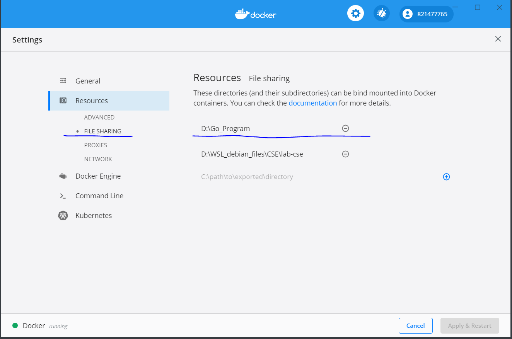

# docker 配置后端

### 第一步，拉取golang镜像

命令行输入以下指令：

```
docker pull golang:latest
```

### 第二步，将GOPATH文件夹设置为共享

有desktop的同学要现在docker 的setting->resourses->file sharing中添加GOPATH的路径，不然在后续文件夹挂载的时候会报错



设置完成后，再在命令行输入如下指令

```
docker run -it --name=jub --privileged -p 8080:8080 --cap-add=ALL -v  D:\Go_Program:/go  golang:latest /bin/bash
```

| -i:           | 以交互模式运行容器，通常与 -t 同时使用；                     |
| ------------- | ------------------------------------------------------------ |
| -t:           | 为容器重新分配一个伪输入终端，通常与 -i 同时使用；           |
| --name:       | 指定docker容器的名字                                         |
| --privileged: | 使用该参数，container内的root拥有真正的root权限。<br/>否则，container内的root只是外部的一个普通用户权限。 |
| -p:           | 将容器的端口映射到宿主机的端口，支持的格式有 `hostPort:containerPort`、`ip:hostPort:containerPort`、 `ip::containerPort`。 |
| --cap-add=ALL | 增强linux能力                                                |
| -v            | 绑定一个卷(文件夹)  本机文件夹路径:映射到docker中的路径      |
| golang:latest | 指定用golang的image                                          |
| /bin/bash     | 执行/bin/bash指令（在docker中）                              |

#### -p端口映射是可以不设置gin的运行的端口（默认在localhost：8080)映射后这个端口就被映射到了宿主机（host）的端口上了，方便本地测试

### 第三步，在docker中访问宿主机的端口

将localhost替换成为host.docker.internal就可以访问本机的端口了

修改完成后，docker中运行的后端就也能连接上本机的数据库和etcd了。