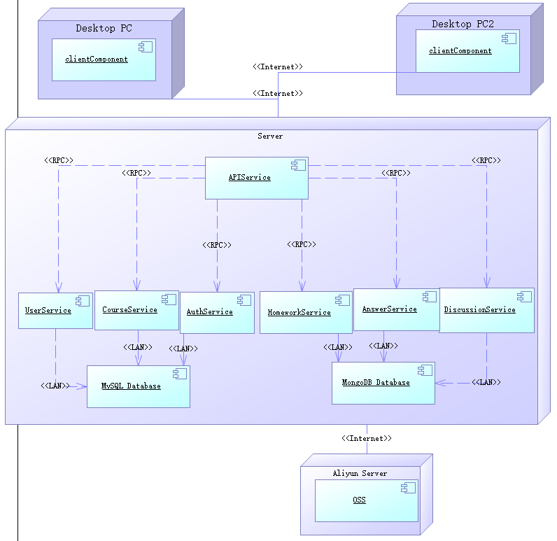
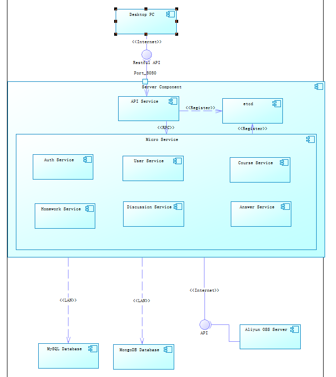

# 软件架构文档

- 项目名称：小箱交云作业平台
- 组号：第三组
- 编写日期：2020/11/15
- 版本：3.0

## 1. 简介

### 1.1 目的

​		本文档将从构架方面对“小箱交云作业平台”进行综合概述，其中会使用用例视图、逻辑视图、部署视图、实现视图、页面视图和GOF设计模式来描述系统的各个方面。它用于记录并表述已对系统的构架方面做出的重要决策。

### 1.2 参考资料

​		[1] 沈备军, 陈昊鹏, 陈雨亭. 软件工程原理[M]. 高等教育出版社, 2013.

## 2. 用例视图

图 2.1 用例视图

## 3. 逻辑视图

### 3.1 概述

​		系统采用B/S架构，可以分解为客户端、服务端与中间件。其中客户端可以进一步分解为接口层、组件层、视图层与路由层。接口层即service包，组件层即component包，视图层即view包，路由层即router包；服务端可以分为接口层与服务层，接口层即api包，服务层即service包；中间件为Middleware包，包括系统开发所使用的React框架、Gin框架、Go-Micro框架以及Go语言提供的MySQL数据库驱动。

图 3.1.1 总体逻辑视图

图3.1.2 Browser端逻辑视图

图3.1.3 Server端逻辑视图

### 3.2 在构架方面具有重要意义的设计包

#### 3.2.1 总体逻辑视图

- Middleware：包括系统开发所使用的React框架、Gin框架、Go-Micro框架以及Go语言提供的MySQL数据库驱动Gorm
- Server：系统的服务端，负责解析客户端发送的请求并调用相应的微服务
- Browser：系统的客户端，负责与客户交互并将请求发送给服务端

#### 3.2.2 客户端逻辑视图

- Service：负责将客户端页面的请求包装成Ajax请求发送给服务端
- Components：负责将从服务端收到的数据进行第一次组装，使其模块化
- View：负责将Components提供的模块组装成页面提供给用户浏览
- Router：提供路由功能，解析用户输入的URL并显示相应的页面
- Utils：由常用工具类组成

#### 3.2.3 服务端逻辑视图

- API：负责拦截客户端发送的请求、解析并分发给不同的微服务进行处理
- Service：实现客户端的业务逻辑

## 4. 进程视图

图4.1 进程视图

​		

​		如图所示，用户管理进程负责处理登录和注册的功能，用户的登录和注册请求通过与后端的UserController进程交互来完成。

​		在用户登录之后，会启动HomeworkProcess，该进程包含与后端HomeworkController交互获取与该登录用户相关的作业列表信息，同时此进程负责作业详情的查询以及返回作业编辑器界面的数据。

​		在编辑作业的过程中（包含学生写作业和老师修改作业内容），独立线程HomeworkCache会处理作业的缓存及与云端同步备份的过程。

​		管理课程的进程通过CourseBoard与用户交互，再将用户修改的信息传递给后端服务器的CourseController进行读写操作。

​		私信功能则由Message进程通过MessageBoard与用户交互后，将信息发送到后端服务器的MessageController上处理，从而完成交互过程。

## 5. 部署视图

图5.1 部署视图

​		客户端运行在PC浏览器上。服务器上部署了APIService、UserService、HomeworkService、AnswerService、DiscussionService、CourseService、AuthService、MySQL Database以及阿里云的OSS Server。客户端与服务端通过互联网连接；服务端内部的各微服务之间通过RPC通信；而微服务访问MySQL数据库可以通过LAN；OSS Server部署在阿里云服务器，所以微服务访问OSS Server需要通过Internet。

### 5.1 在物理架构中具有重要意义的组件

#### 5.1.1 UserService

​		负责用户部分的业务逻辑，负责管理用户个人信息

#### 5.1.2 AuthService

​		负责用户登录、授权以及权鉴

#### 5.1.3 HomeworkService

​		负责作业部分的业务逻辑，包括作业内容的存储

#### 5.1.4 CourseService

​		负责课程部分的业务逻辑，包括课程的详细信息、开课老师以及参与课程的学生

#### 5.1.5 DiscussionService

​		负责论坛讨论以及实施私信交流的业务逻辑

#### 5.1.6 AnswerService

​		负责存储学生的答案以及教师对于答案的批改信息

#### 5.1.7 APIService

​		是后端微服务集群的网关，客户端的请求统一发送到APIService，再由APIService通过RPC转发给相应的微服务

#### 5.1.8 MySQL Database

​		负责存储结构化数据，包括用户信息、课程信息以及用户与课程之间的关联关系

#### 5.1.9 OSS Server

​		负责存储非结构化数据，包括作业内容、作业答案、教师批改作业的详情等

## 6. 实现视图

图6.1 实现视图

​		如图所示是本项目的实现视图。运行在客户PC浏览器的客户端通过Restful API向本项目的后端服务器发送请求。在后端服务器中运行的API Service会拦截来自客户端的请求，解析该请求，并将该请求分发给运行在后端服务器的某个微服务。本项目目前计划实现六大服务：User Service, Auth Service, Course Service, Discussion Service, Answer Service与Homework Service，分别处理关于用户信息、用户授权与权鉴、课程管理、在线讨论、答案管理以及作业管理这些方面的业务逻辑以及对应的与数据库交互的部分。

## 7. 页面视图

图7.1 页面视图

​		如图所示是本项目浏览器端的页面视图，详细展示了各个页面之间的关系。

## 8. GOF设计模式

### 8.1 作业发布

图8.1 作业发布

我们认为作业发布中用到了两种设计模式：Prototype和Factory Method模式

- 在发布作业时，对于teacher，releasedate，deadline等属性，可以通过模板快速自动生成，避免教师用户的重复操作,属于Prototype模式。

- 在添加题目时，我们提供了三个类型：选择题，填空题，作文题，可以选择三种类型题目的创造器(QuestionCreator)生成对应模板，客户代码可以做到与特定应用无关，属于Factory Method模式。

  

  ### 8.2 SSO单点登录
  
  
  
  
图8.2 单点登录

  
  ​	对于SSO单点登录服务，我们使用的是单例模式，在整个系统中仅存在一个。这是因为单例模式提供了对唯一实例的受控访问；它可以严格控制客户怎样以及何时访问它。而对于本项目来说，云作业平台客户在登陆的时候调用类的单个实例只允许使用一个公共访问点，除了该公共访问点，不能通过其他途径访问该实例，这是为了保证整个系统的安全性。所以单例模式适用于单点登录。

