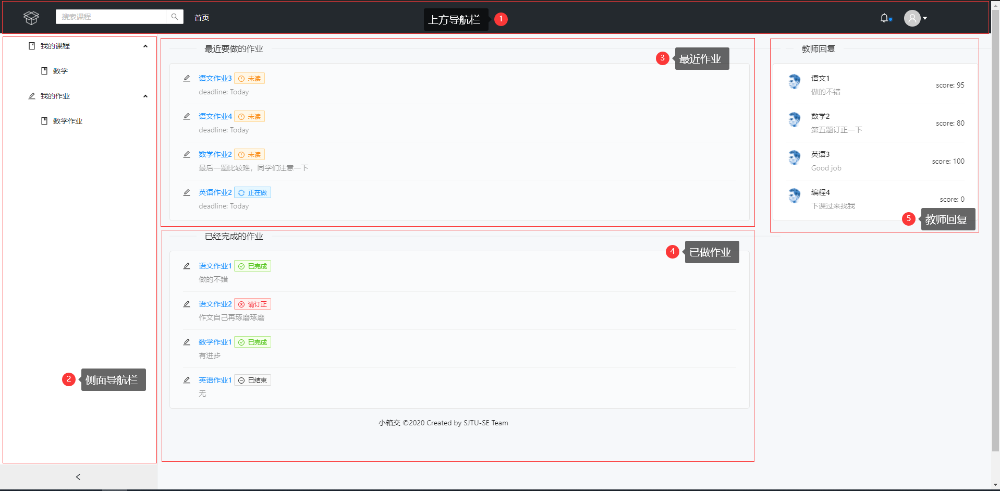
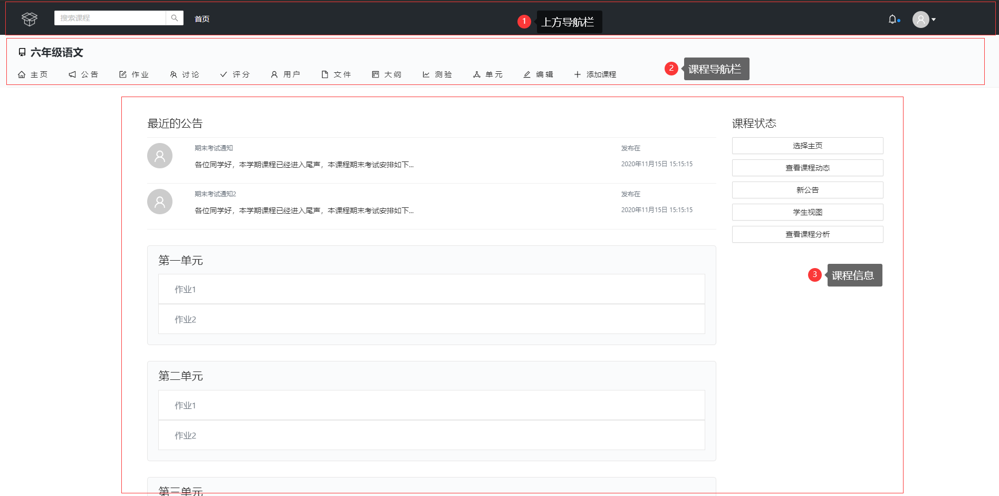
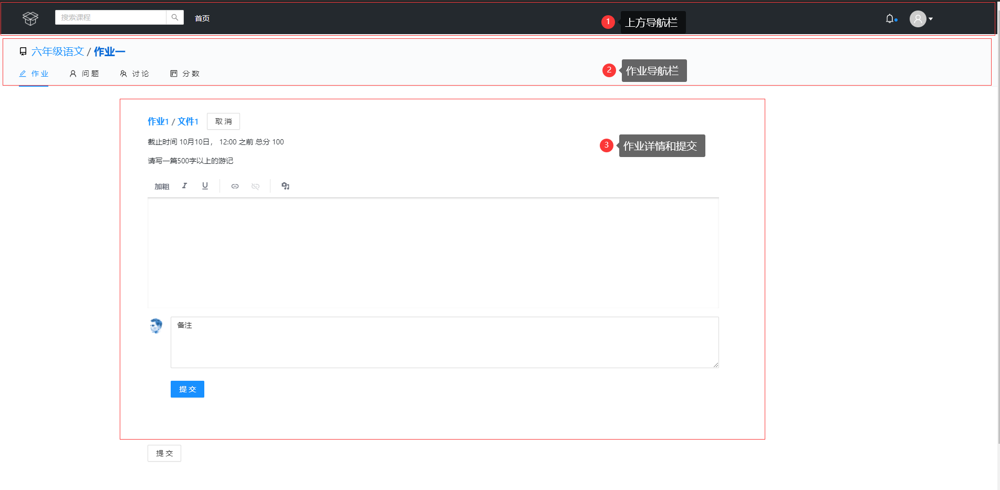

# 小箱交前端页面设计和优化报告

## 目标用户分析：

小箱交作为一个面向广大中小学师生的云作业平台应用，主要受众为师生，属于熟练型用户。

对于作业管理业务较为简单，界面风格设计仿照GitHub，统一美观。

## 典型界面分析

### 主页

1. 上方导航栏：点击小箱交Logo即可返回主页面，为了防止用户首次操作不熟练，特意增加了首页按钮；右侧可以直接访问用户个人信息。

2. 侧面导航栏：用户可以在此处非常方便地查看自己的课程和作业信息。

3. 最近作业：为了方便学生及时掌握最近要做的作业，特意设置此模块，位于正中，醒目且有状态提醒。

4. 已经完成的作业：学生可以在此处查看已经做完的作业，及时回顾。

5. 教师回复：学生可以及时看到教师对自己的评价和留言信息。

   总的来说：主页包含了所有重要模块，简洁但是方便。

### 课程页

1. 上方导航栏：点击小箱交Logo即可返回主页面，为了防止用户首次操作不熟练，特意增加了首页按钮；右侧可以直接访问用户个人信息。
2. 课程导航栏：用户可以在此处切换并查看课程各方面的信息
3. 课程信息：课程信息简介明了，利于查看

### 作业页

1. 上方导航栏：点击小箱交Logo即可返回主页面，为了防止用户首次操作不熟练，特意增加了首页按钮；右侧可以直接访问用户个人信息。
2. 作业导航栏：用户可以在此处切换并查看作业各方面的信息。
3. 作业详情和提交：此处可以方便查看作业内容，学生可以利用富文本框的形式提交作业，并可以增加备注内容。