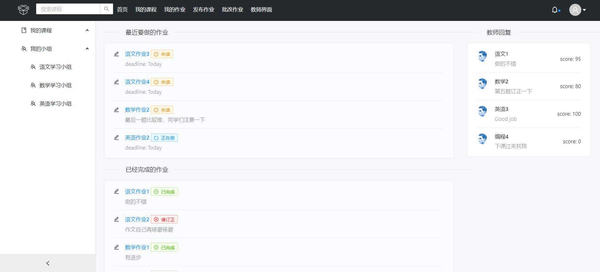
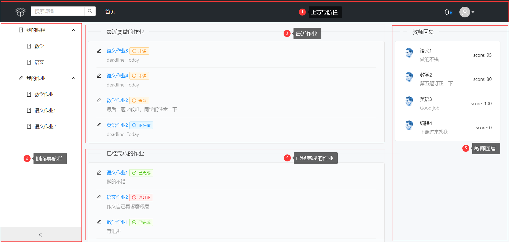
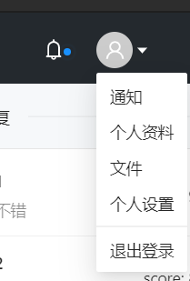
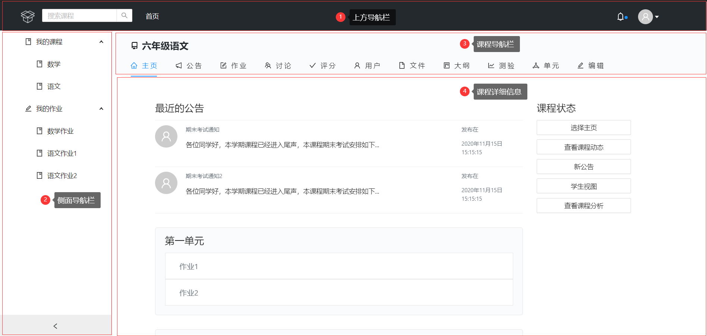
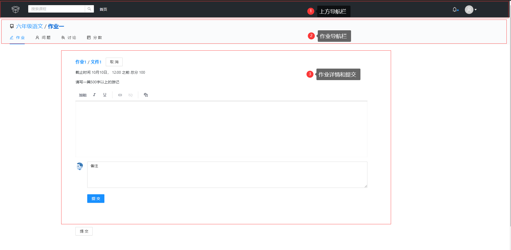
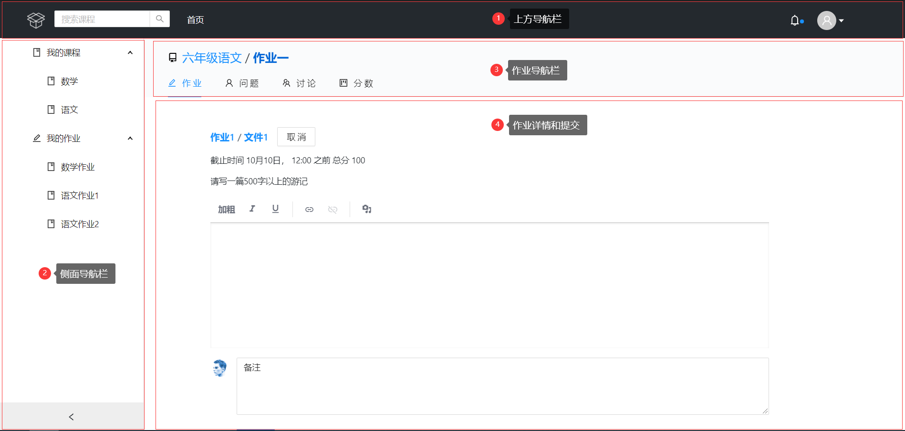

# 小箱交前端页面设计和优化报告

## 目标用户分析：

小箱交作为一个面向广大中小学师生的云作业平台应用，主要受众为师生，属于熟练型用户，但也要考虑初始使用时的初学型用户，界面设计要简洁明了，功能清楚明确。

对于作业管理业务较为简单，界面风格设计仿照Github，统一美观，也能让学生尽早熟悉，便于以后的学习。

## 优化策略

1. 提高页面的使用便捷性
2. 替用户着想，减少用户的记忆，让本产品越用越好用
3. 保持界面的一致性

## 优化措施

1. 针对优化策略的第一点，我们增加了页面左侧导航栏而取消了页面头部导航栏中的导航条目，这是因为左侧导航栏以垂直列表方式呈现内容，每个导航按钮有充分的空间显示，十分清晰，并且导航按钮可以分类呈现；而如果将导航按钮都堆叠在页面头部导航栏则显得十分拥挤，不方便用户使用。
2. 针对优化策略的第二点，我们在主页中增加了提醒学生最近要完成的作业以及已经完成的作业内容，同时还增加了教师回复的消息提醒，方便了用户的使用，减少了用户的记忆。
3. 针对优化策略的第三点，我们在每个页面都保留了左侧导航栏的设计，这样不仅可以保证页面设计的一致性，而且方便用户在任何页面都可以进行页面跳转。

## 具体界面分析

### 主页

优化前：

优化后：

1. 上方导航栏：点击小箱交Logo即可返回主页面，为了防止用户首次操作不熟练，特意增加了首页按钮（教师界面会有添加课程等功能）；右侧可以直接访问用户个人信息，里面汇集了如通信设置等常用功能。（如图所示）

   

2. 侧面导航栏：用户可以在此处非常方便地查看自己的课程和作业信息。

3. 最近作业：为了方便学生及时掌握最近要做的作业，特意设置此模块，位于正中，醒目且有状态提醒，最近作业可以按deadline结束时间排序，学生不会错过作业。

4. 已经完成的作业：学生可以在此处查看已经做完的作业，及时回顾。

5. 教师回复：学生可以及时看到教师对自己的评价和留言信息。

### 课程页

优化前：

优化后：

1. 上方导航栏：点击小箱交Logo即可返回主页面，为了防止用户首次操作不熟练，特意增加了首页按钮；右侧可以直接访问用户个人信息。
2. 侧面导航栏：用户可以在此处非常方便地查看自己的课程和作业信息。
3. 课程导航栏：用户可以在此处切换并查看课程各方面的信息（教师界面会有更多如发布作业等功能）。
4. 课程详细信息：课程信息简介明了，利于查看。

### 作业页

优化前：

优化后：

1. 上方导航栏：点击小箱交Logo即可返回主页面，为了防止用户首次操作不熟练，特意增加了首页按钮；右侧可以直接访问用户个人信息。
2. 侧面导航栏：用户可以在此处非常方便地查看自己的课程和作业信息。
3. 作业导航栏：用户可以在此处切换并查看作业各方面的信息。
4. 作业详情和提交：此处可以方便查看作业内容，学生可以利用富文本框的形式提交作业，并可以增加备注内容。