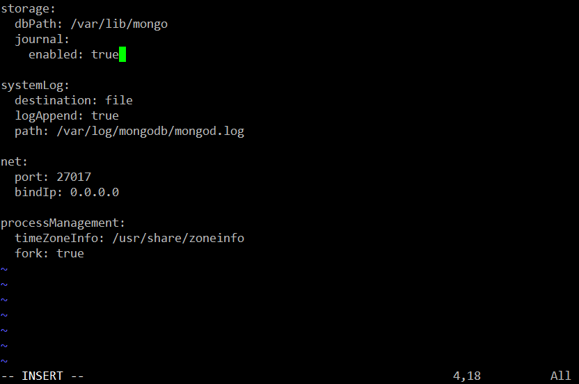

## MySQL

mysql搭建有两个渠道，分别是：aws的RDS服务和自行在云主机上搭建。

* ### RDS服务

  RDS专门用于关系型数据库，好处是不用进行相关配置就可以直接用aws提供的公网dns进行连接。具体操作如下：

  1. 登陆aws账号，进入控制台，在左上角的服务中找到RDS

     

  2. 点击创建数据库，之后就按照网站的指南一步步向下做就行了

  3. 创建成功后会给你一个数据库的公网ip，如：

     

  4. 在navicat中输入主机名、用户名和密码测试连接

* ### EC2搭建

  EC2（Amazon Elastic Compute Cloud）可以看成是一台云主机。这部分将在云主机上自己搭建MySQL数据库。

  1. 申请EC2，OS为Ubuntu18.04，储存空间啥的可以申请的多一些。

  2. 下载putty。云主机默认只开放80端口用于SSH远程连接。putty是用于远程连接的客户端。来自aws的[官方教程](https://docs.aws.amazon.com/zh_cn/AWSEC2/latest/UserGuide/putty.html) 。另外，连接前需要在EC2控制台界面中生成SSH密钥，如下图所示：

     

     按照上面的提示做就好了。

  3. 用putty连接EC2后的界面如下，一开始的用户名是ubuntu

     

  4. 安装MySQL

     * [安装教程](https://blog.csdn.net/weixin_42209572/article/details/98983741)

     - [设置bind-ip](https://blog.csdn.net/zc5450725/article/details/89054441) (bind-ip默认为localhost，即127.0.0.1，表示只允许本地连接数据库)

     - 允许root用户以远程登陆的形式访问所有数据库 [link](https://www.cnblogs.com/wintest/p/11442920.html)

       - 附上mysql跳过登陆验证以及更改root密码方法 [link](https://www.linuxidc.com/Linux/2018-05/152586.htm) [link2](https://www.cnblogs.com/super-zhangkun/p/9435974.html)

     - 在aws console中设置安全组，设置入站规则为开放端口3306，同时允许任何ip访问。然后在具体ec2实例中加入安全组。

       

     - 后续用EC2的公网IP就可以访问数据库了

     

## MongoDB

1. 安装MongoDB [link](https://www.runoob.com/mongodb/mongodb-linux-install.html)

   - 注意这边启动命令是直接在命令中加入参数，另一种启动方法是通过配置文件启动。推荐使用配置文件启动，因为使用的参数会很多。

   - 具体方法为：在/etc/找到mongod.conf文件，输入`vim /etc/mongod.conf`，如下图添加配置：

   - 

     

     然后保存退出。之后再回到`/usr/local/mongodb/bin`，输入`./mongod -f /etc/mongod.conf`启动就行。

     其中有一个关键要注意，就是bindIp参数，意思和MySQL的bind-ip类似。

2. EC2开放端口27017，步骤和MySQL一样。
3. 通过EC2的公网IP用navicat链接即可

